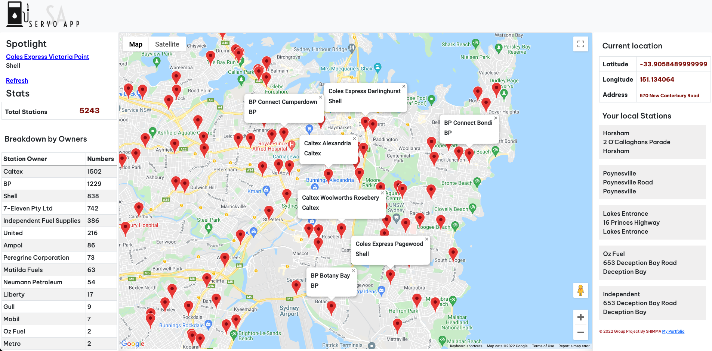

# SERVO APP <a href="https://servo-app-heroku.herokuapp.com/"> Demo </a>
## Find your local Petrol stations
### Restful App Built by : JavaScript, Node.JS, Express, PostgreSQL, HTML, CSS by Bootstrap5
#### Google Maps API(Restricted to only the app URL and 10 request per day per user) 
#### Publicly accessible Australian Petrol station dataset for 2012 downloaded from <a href="https://data.gov.au/"> Data.GOV.AU </a> , also can be found in .data/PetrolStasions.CSV
#### A group project, contributors can be found in this Git right panel

- at window.onload: App asks permission for users location, given permission, map centers on users location, and reflects users latitude, longitude and address on the right panel under current location.
- at window.onload: map shows all petrol stations accross Australia as markers(5243). Clicking on markers opens info window containing stations name and address. also current location on right panel will be changed to servo's details.
- Spotlight shows a random servo, clicking on it centers the map on it location. Refresh changes the random servo.
- Stats is where you find the total number of stations and a breakdown by owner section where stations are broken down by oweners(only the ones owing greater than or equal to 2 stations). Caltex owns the most, interesting, something extra to learn for me!
- On the right panel, your local stations section was planned to return 5 nearest servos to user, however it is not functional yet, it now returns 5 random stations, something to work on in upcoming commits. 

### ScreenShot

